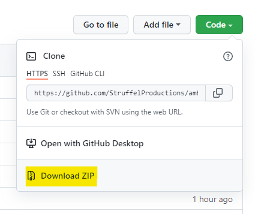
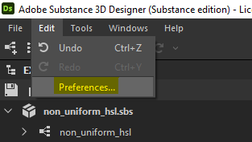
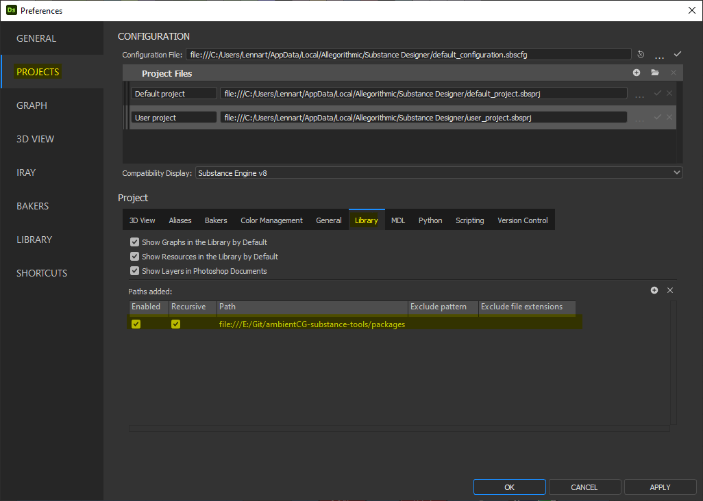
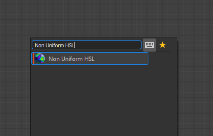
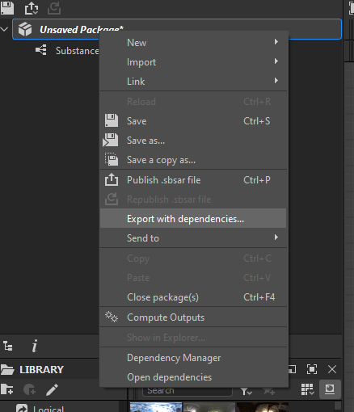

# The substance helpers collection
This repository contains useful new nodes for **Adobe Substance 3D Designer** which you can import and use in your own projects. Most of them are made by me while working on assets for [ambientCG](https://ambientCG.com).

## Installation
1. Start by downloading the content of this repository using GIT or by clicking on **Code** -> **Download ZIP** in the browser.

2. Extract the ZIP archive into a location where it won't get in the way (it needs to stay in that place permanently).
3. Open Substance 3D Designer and navigate to **Edit** -> **Preferences**.

4. Navigate to **PROJECTS** -> **Library** and then add the `/packages` subfolder to the list using the plus icon in the top right corner.

## Usage
After installing the package you can start using the nodes included in it.

If you want to pass on a graph that uses nodes from this collection to someone else, make sure to use the **Export with dependencies...** function to ensure that all the required files are packed along with your project, so that everyone can open it!

